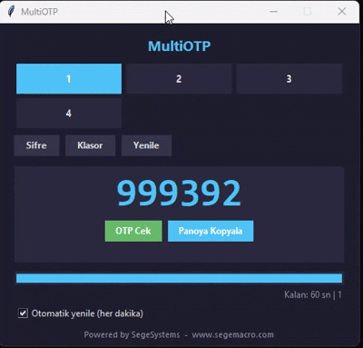

# MultiOTP

Knight Online icin **coklu hesap destekli OTP goruntuleyici**. Tum hesaplarinizi tek arayuzden yonetin, tek tikla hesaplar arasi gecis yapin, OTP kodunu aninda alin.




---

## Ozellikler

- **Tek dosya** - sadece `MultiOTP.exe`, kurulum yok, Python yok
- **Coklu hesap** - her hesap icin ayri klasor, butonlarla anlik gecis
- **Otomatik OTP uretimi** - hesap secince registry import + OTP uretimi tek seferde
- **Otomatik yenileme** - her dakika basinda OTP yenilenir (kullanici izninde)
- **Sessiz pano** - sadece **Panoya Kopyala** butonuna ya da OTP rakamlarina tikladiginda kopyalar; OTP uretiminde kendi kendine panoya yazmaz
- **Kopyalandi feedback** - tikladiginda buton yesile doner, "KOPYALANDI" yazar, beep verir
- **Admin yetkisi gerekmez** - tum islemler HKCU ve user-writable yollarda

---

## Gereksinimler

- **Windows 10/11** (64-bit)
- **AnyOTPSetup** kurulu olmali (`C:\Program Files (x86)\AnyOTPSetup\AnyOTPBiz.dll`)

Python, .NET, Visual C++ runtime vs. **gerekmez** - hepsi exe icinde paketli.

---

## Kurulum

1. `MultiOTP.exe` dosyasini indirin
2. Bos bir klasore (orn. `C:\Tools\MultiOTP\`) atin
3. Yaninda `otps/` klasoru olusturun
4. Calistirin

```
C:\Tools\MultiOTP\
├── MultiOTP.exe
└── otps\
    └── <hesap>\
        ├── SpoofInfo.txt
        └── OtpInfo.reg
```

Programi acinca `config.json` otomatik olusur (sifrelerinizi orada tutar).

---

## Hesap Ekleme

### 1. Klasor olustur

`otps/` altinda hesap adiyla bir klasor:

```
otps/
└── benimhesabim/
    ├── SpoofInfo.txt
    └── OtpInfo.reg
```

> **Not:** `_` veya `.` ile baslayan klasorler (`_example`, `.template` vb.) GUI'de gosterilmez. Sablon/yedek tutmak isterseniz boyle adlandirin.

### 2. Dosyalar

| Dosya | Ne icerir |
|-------|-----------|
| `SpoofInfo.txt` | 3 satir: PNP device ID, signature, tail |
| `OtpInfo.reg` | `HKCU\Software\AnyOTP` icin VMdata + EnvInfo registry kayitlari |

Bu dosyalari **hesap saglayicidan** alirsiniz - MultiOTP uretmez.

### 3. Programda

- `Yenile` butonuna basin → yeni hesap butonlarda goruncek
- Hesabin butonuna tiklayin → **6 haneli OTP sifresi** sorulur
- Sifre `config.json`'a kaydedilir, bir daha sorulmaz
- Sifreyi degistirmek icin: `Sifre` butonu

---

## Kullanim

```
+-----------------------------------+
|         MultiOTP                  |
|  [hesap1] [hesap2] [hesap3]       |  <- basinca o hesaba gecer
|  [hesap4] [hesap5]                |
|                                   |
|  [Sifre] [Klasor] [Yenile]        |
|  +-----------------------------+  |
|  |       4 0 7 1 3 9           |  |  <- tikla = kopyala
|  |  [OTP Cek] [Panoya Kopyala] |  |
|  +-----------------------------+  |
|  [████░░░] 42 sn | hesap1         |
|  [✓] Otomatik yenile              |
|  [hesap1] OTP hazir               |
|  Powered by SegeSystems           |
+-----------------------------------+
```

- **Hesap butonu** - tek tikla gecis (mavi vurgu = aktif hesap)
- **OTP rakamlarina tikla** - panoya kopyalar
- **Panoya Kopyala** - kopyalar, buton yesile doner "KOPYALANDI" yazar
- **Sifre** - aktif hesabin OTP sifresini degistir
- **Klasor** - aktif hesabin klasorunu Explorer'da ac
- **Yenile** - yeni hesap klasorlerini taramak icin

---

## Sik Sorulanlar

**S: AnyOTPBiz.dll bulunamadi diyor.**
C: AnyOTPSetup'i kurun. NTT Games'in resmi OTP yazilimidir, Knight Online icin gerekli. `C:\Program Files (x86)\AnyOTPSetup\AnyOTPBiz.dll` var olmali.

**S: OTP "000000" donuyor / hata veriyor.**
C: Hesap sifresi yanlis ya da `OtpInfo.reg` / `SpoofInfo.txt` ait oldugu hesapla eslesmiyor. `Sifre` butonundan dogrusunu girin.

**S: Otomatik yenilemede pano siliniyor mu?**
C: Hayir. Panoya kopyalama sadece **Panoya Kopyala** butonuna ya da OTP rakamlarina **tikladiginda** olur.

**S: Bir hesap eklemek icin ne yapmaliyim?**
C: `otps/yeniHesap/` klasoru olusturun, `SpoofInfo.txt` ve `OtpInfo.reg` dosyalarini koyun, GUI'de **Yenile** butonuna basin.

**S: Sifrelerim nerede saklaniyor?**
C: `MultiOTP.exe`'nin yaninda olusan `config.json` dosyasinda, **duz metin** olarak. Local makineniz disinda paylasmayin.

**S: Antivirus uyari verdi.**
C: PyInstaller ile paketlenen exe'lerde bazen false positive olur.

---

## Lisans

MIT - bkz. [LICENSE](LICENSE)

---

Powered by **[SegeSystems](https://www.segemacro.com)**
